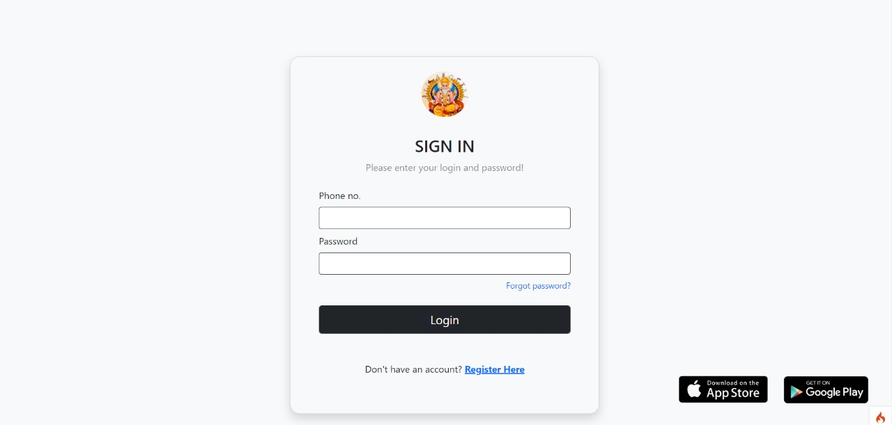

# Matrimonial
Description: Anything matrimonial has something to do with marriage or married people. A formal way to say "wedding," for example, would be "matrimonial event."

Marriage is a matrimonial agreement or bond, and the house a newly wed couple moves into can be called a matrimonial home. Matrimonial law governs the rules of marriage — like the license that declares two people legally married, or the age a person must be, legally, to get married. Originally, matrimonial was a noun meaning "a marriage," and then "a classified ad posted by someone seeking a spouse." 

Tools used: PHP7, HTML5, JavaScript (JQuery, Bootstrap), CSS3, MySQL, CodeIgniter 4


## Running locally
 
 - Create New Database (matrimonial) then import matrimonial.sql file on it.
 - go to PATH **core/classes/connection.php** and add your database info.

 ```php
    protected static $servername = "localhost";
    protected static $db_name="matrimonial";
    protected static $username = "root";
    protected static $password = "";
```
 then the project is ready to run in localhost!

## 📷 UI


### Index



### admin penal


### Dhashbord (Admin) 


### Dhashbord (Member)


### Dhashbord (Moderatros)


### Profile


### Edit profile


### Messages 


### Notifition


### Gotras


### Matrial Status


### Member


### Moderatros


# CodeIgniter 4 Application Starter

## What is CodeIgniter?

CodeIgniter is a PHP full-stack web framework that is light, fast, flexible and secure.
More information can be found at the [official site](http://codeigniter.com).

This repository holds a composer-installable app starter.
It has been built from the
[development repository](https://github.com/codeigniter4/CodeIgniter4).

More information about the plans for version 4 can be found in [the announcement](http://forum.codeigniter.com/thread-62615.html) on the forums.

The user guide corresponding to this version of the framework can be found
[here](https://codeigniter4.github.io/userguide/).

## Installation & updates

`composer create-project codeigniter4/appstarter` then `composer update` whenever
there is a new release of the framework.

When updating, check the release notes to see if there are any changes you might need to apply
to your `app` folder. The affected files can be copied or merged from
`vendor/codeigniter4/framework/app`.

## Setup

Copy `env` to `.env` and tailor for your app, specifically the baseURL
and any database settings.

## Important Change with index.php

`index.php` is no longer in the root of the project! It has been moved inside the *public* folder,
for better security and separation of components.

This means that you should configure your web server to "point" to your project's *public* folder, and
not to the project root. A better practice would be to configure a virtual host to point there. A poor practice would be to point your web server to the project root and expect to enter *public/...*, as the rest of your logic and the
framework are exposed.

**Please** read the user guide for a better explanation of how CI4 works!

## Repository Management

We use GitHub issues, in our main repository, to track **BUGS** and to track approved **DEVELOPMENT** work packages.
We use our [forum](http://forum.codeigniter.com) to provide SUPPORT and to discuss
FEATURE REQUESTS.

This repository is a "distribution" one, built by our release preparation script.
Problems with it can be raised on our forum, or as issues in the main repository.

## Server Requirements

PHP version 7.3 or higher is required, with the following extensions installed:

- [intl](http://php.net/manual/en/intl.requirements.php)
- [libcurl](http://php.net/manual/en/curl.requirements.php) if you plan to use the HTTP\CURLRequest library

Additionally, make sure that the following extensions are enabled in your PHP:

- json (enabled by default - don't turn it off)
- [mbstring](http://php.net/manual/en/mbstring.installation.php)
- [mysqlnd](http://php.net/manual/en/mysqlnd.install.php)
- xml (enabled by default - don't turn it off)

